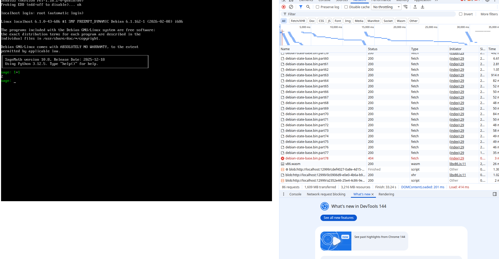

SageMath in Browser

Screenshot:

How to build:

- clone this project
- delete "images" folder
- run `cd tools/docker/SageMath`
- run `./build.sh`
- run `./build-state.js`
- run 'cp split.sh ../../../images/split.sh'
- run `cd ../../../images`
- run './split.sh'
- run 'rm debian-9p-rootfs.tar debian-state-base.bin'
- run 'cd ..'
- run `make run`

  This should start a server on 8000 (or other ports).

Note:
- The script 'tools/docker/SageMath/build_proxy.sh' contain the proxy configuration and deb mirror. Use it if you cannot connect to github and debian repository directly.
- The folder 'tools/docker/SageMath-apt' contains the build setting for legacy sage 9.5 via apt.

Todo:
- Add persistent storage (see https://github.com/MercuryWorkshop/v86)

Credit:
- SageMath: https://www.sagemath.org/
- v86: https://github.com/copy/v86
- sandbox.bio's debian 12 on v86 configuration: https://github.com/sandbox-bio/v86
